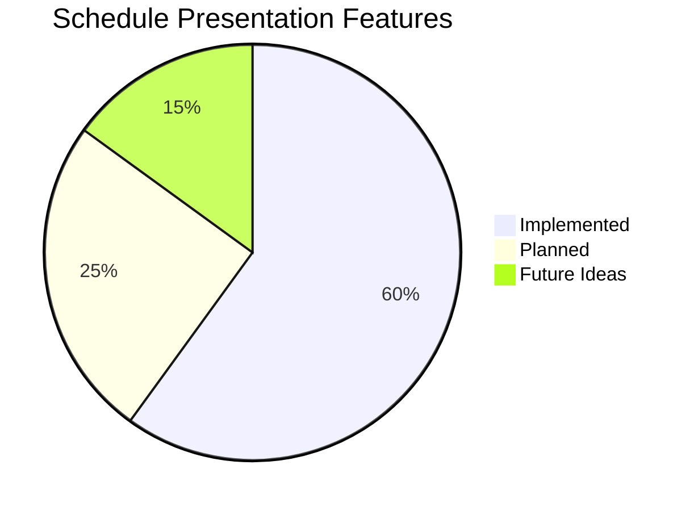

# Schedule Presentation Methods: Comprehensive Guide

**Version:** 1.0
**Date:** October 15, 2025
**Document Purpose:** Complete guide to presenting, visualizing, and exporting pharmaceutical filling schedules

---

## Table of Contents

1. [Overview](#1-overview)
2. [Interactive Web Visualizations](#2-interactive-web-visualizations)
3. [Export Formats](#3-export-formats)
4. [Report Formats](#4-report-formats)
5. [Real-Time Presentations](#5-real-time-presentations)
6. [Print & Physical Formats](#6-print--physical-formats)
7. [Dashboard & Analytics Views](#7-dashboard--analytics-views)
8. [Mobile & Tablet Presentations](#8-mobile--tablet-presentations)
9. [API Data Formats](#9-api-data-formats)
10. [Future Enhancement Ideas](#10-future-enhancement-ideas)

---

## 1. Overview

### 1.1 Presentation Methods Matrix

| Method | Format | Use Case | Audience | Interactivity |
|--------|--------|----------|----------|---------------|
| **Timeline Gantt Chart** | SVG/Web | Schedule overview | All users | ✅ High |
| **Activity List** | Table/Web | Detailed review | Operators | ⚠️ Medium |
| **KPI Dashboard** | Web | Performance metrics | Management | ✅ High |
| **PDF Report** | PDF | Documentation | GMP/Audit | ❌ None |
| **Excel Workbook** | XLSX | Analysis | Analysts | ⚠️ Medium |
| **CSV Export** | CSV | Data integration | Systems | ❌ None |
| **JSON API** | JSON | Programmatic | Developers | ❌ None |
| **WebSocket Stream** | Real-time | Live monitoring | Operations | ✅ High |
| **Calendar View** | Web/iCal | Planning | All users | ✅ High |
| **3D Timeline** | WebGL | Executive demo | Management | ✅ High |
| **Print Layout** | HTML/Print | Floor posting | Operators | ❌ None |

### 1.2 Current Implementation Status



**Implemented (60%):**
- ✅ Timeline Gantt Chart (SVG)
- ✅ Activity List Table
- ✅ KPI Statistics Cards
- ✅ JSON Export
- ✅ CSV Export
- ✅ PDF Export (with WeasyPrint)
- ✅ Excel Export (with OpenPyXL)
- ✅ WebSocket Progress Updates

**Planned (25%):**
- 🚧 Calendar View
- 🚧 Comparison Charts
- 🚧 Mobile-optimized views
- 🚧 Print-friendly layouts

**Future Ideas (15%):**
- 💡 3D Interactive Timeline
- 💡 AR Floor Overlay
- 💡 Voice-controlled navigation
- 💡 Animated schedule playback

---

## 2. Interactive Web Visualizations

### 2.1 Timeline Gantt Chart (Primary View)

#### **Description:**
Interactive SVG-based Gantt chart showing activities over time, organized by resources (fillers).

#### **Features:**
```typescript
interface TimelineGanttChartFeatures {
  // Visual Elements
  activities: Activity[]          // All scheduled activities
  fillers: Filler[]               // Production line resources
  timeGrid: TimeMarker[]          // Time axis markers

  // Interactivity
  zoom: ['1h', '4h', '8h', '24h', 'all']  // Time scale control
  filter: ['all', 'FILL', 'CLEAN', 'CHANGEOVER']  // Activity type filter
  selection: ActivitySelection    // Click to select/highlight
  hover: TooltipDisplay          // Hover for details

  // Display Options
  colorScheme: ActivityColorMap   // Color-coded by type
  labels: boolean                 // Show/hide activity labels
  grid: boolean                   // Show/hide time grid
  legend: boolean                 // Show/hide legend
}
```

#### **Implementation:**
```typescript
// Current: TimelineGanttChart.tsx
<TimelineGanttChart
  activities={scheduleData.activities}
  numFillers={3}
  makespan={schedule.makespan}
  onActivityClick={handleActivityClick}
/>
```

#### **Visual Example:**
```
Resources │
          │
Filler 1  │ [CLEAN────────────] [FILL──────] [CHG] [FILL────]
          │ 0h────────────24h  24h─────────40h 40h 44h────60h
          │
Filler 2  │ [CLEAN────────────] [FILL───────────────────]
          │ 0h────────────24h  24h─────────────────────70h
          │
Filler 3  │ [CLEAN────────────] [CHG] [FILL────] [FILL──────]
          │ 0h────────────24h  24h 32h─────50h 50h────────72h
          │
Time      └──────────────────────────────────────────────────>
          0h      24h      48h      72h      96h     120h
```

#### **Enhancements:**

**A. Multi-Resource View**
```typescript
interface MultiResourceView {
  resources: {
    fillers: FillerGroup[]        // Multiple filling lines
    cleanrooms: CleanroomGroup[]  // Associated cleanrooms
    operators: OperatorShift[]    // Operator schedules
  }
  dependencies: TaskDependency[]  // Show dependencies between resources
}
```

**B. Critical Path Highlighting**
```typescript
// Highlight activities on critical path
const criticalPath = calculateCriticalPath(activities);
activities.map(a => ({
  ...a,
  isCritical: criticalPath.includes(a.id),
  style: a.isCritical ? { stroke: '#f44336', strokeWidth: 3 } : {}
}))
```

**C. Drag-and-Drop Rescheduling**
```typescript
// Allow manual adjustments
const handleDrag = (activityId: string, newStartTime: number) => {
  // Validate constraints
  if (validateMove(activityId, newStartTime)) {
    // Update schedule
    updateSchedule({ activityId, newStartTime });
    // Recalculate dependent activities
    recalculateDependencies(activityId);
  }
}
```

**D. Zoom & Pan Controls**
```typescript
// Infinite zoom with smooth transitions
const zoomControls = {
  zoomIn: () => setScale(scale * 1.5),
  zoomOut: () => setScale(scale / 1.5),
  panLeft: () => setOffset(offset - 100),
  panRight: () => setOffset(offset + 100),
  fitToView: () => autoScale(activities),
  zoomToSelection: (selection: Activity[]) => focusOn(selection)
}
```

---

### 2.2 Activity List (Table View)

#### **Description:**
Detailed tabular view of all activities with sorting, filtering, and search.

#### **Features:**
```typescript
interface ActivityListFeatures {
  // Display
  columns: ActivityColumn[]       // Customizable columns
  sorting: SortConfig            // Multi-column sorting
  filtering: FilterConfig        // Advanced filters
  grouping: GroupConfig          // Group by type/filler/lot

  // Interactivity
  search: string                 // Full-text search
  selection: ActivityId[]        // Multi-select
  export: ExportFormat[]         // Export selected rows

  // Styling
  colorCoding: boolean           // Color by activity type
  compactView: boolean           // Dense/comfortable spacing
  virtualScrolling: boolean      // Performance for large datasets
}
```

#### **Implementation:**
```typescript
<ActivityList
  activities={activities}
  sortBy="start_time"
  sortOrder="asc"
  onRowClick={handleRowClick}
  selectedRows={selectedActivities}
/>
```

#### **Table Structure:**
```
┌────────┬──────────────┬──────────────┬──────────┬─────────────┬──────────┬──────────┬─────────┐
│ Start  │ End          │ Duration     │ Type     │ Lot ID      │ Filler   │ Vials    │ Status  │
├────────┼──────────────┼──────────────┼──────────┼─────────────┼──────────┼──────────┼─────────┤
│ 00:00  │ 24:00        │ 24h          │ CLEAN    │ -           │ Line 1   │ -        │ Done ✓  │
│ 24:00  │ 40:00        │ 16h          │ FILL     │ LOT-2025-01 │ Line 1   │ 318,720  │ Done ✓  │
│ 40:00  │ 44:00        │ 4h           │ CHG      │ -           │ Line 1   │ -        │ Done ✓  │
│ 44:00  │ 60:00        │ 16h          │ FILL     │ LOT-2025-02 │ Line 1   │ 318,720  │ Running │
│ 60:00  │ 64:00        │ 4h           │ CHG      │ -           │ Line 1   │ -        │ Pending │
└────────┴──────────────┴──────────────┴──────────┴─────────────┴──────────┴──────────┴─────────┘
```

#### **Enhancements:**

**A. Advanced Filtering**
```typescript
interface AdvancedFilter {
  timeRange: { start: Date; end: Date }
  activityTypes: ActivityType[]
  fillers: number[]
  lotTypes: string[]
  durationRange: { min: number; max: number }
  customFilters: CustomFilter[]
}
```

**B. Grouping & Aggregation**
```typescript
// Group by filler with aggregated stats
const grouped = groupBy(activities, 'filler_id', {
  aggregate: {
    total_duration: sum('duration'),
    fill_count: count(where({ kind: 'FILL' })),
    avg_utilization: avg('utilization')
  }
})
```

**C. Inline Editing**
```typescript
// Editable cells for manual adjustments
const handleCellEdit = (activityId: string, field: string, value: any) => {
  updateActivity(activityId, { [field]: value });
  validateSchedule(); // Re-validate after edit
}
```

---

### 2.3 KPI Dashboard Cards

#### **Description:**
Summary statistics and key performance indicators displayed as cards.

#### **Metrics:**
```typescript
interface KPIMetrics {
  // Primary KPIs
  makespan: { value: number; unit: 'hours'; trend?: 'up' | 'down' | 'stable' }
  utilization: { value: number; unit: 'percent'; target: number }
  changeovers: { value: number; unit: 'hours'; comparison?: number }

  // Secondary KPIs
  lotsScheduled: number
  blocks: number
  fillTime: number
  cleanTime: number
  avgCycleTime: number

  // Quality Metrics
  windowViolations: number
  constraintsSatisfied: boolean
  scheduleEfficiency: number
}
```

#### **Visual Layout:**
```
┌─────────────────┬─────────────────┬─────────────────┬─────────────────┐
│ Makespan        │ Utilization     │ Changeovers     │ Lots Scheduled  │
│ 232.7 h         │ 86.1%           │ 20.0 h          │ 15              │
│ ↓ 5.2% better   │ ○○○○○○○●● 86%   │ ↑ 2h more       │ ✓ All           │
└─────────────────┴─────────────────┴─────────────────┴─────────────────┘

┌─────────────────┬─────────────────┬─────────────────┬─────────────────┐
│ Clean Time      │ Fill Time       │ Blocks          │ Efficiency      │
│ 48.0 h          │ 164.7 h         │ 2               │ 92.3%           │
│ 2 cycles        │ 70.8% of total  │ Optimal         │ ⭐⭐⭐⭐⭐        │
└─────────────────┴─────────────────┴─────────────────┴─────────────────┘
```

#### **Enhancements:**

**A. Sparkline Trends**
```typescript
// Mini charts showing KPI trends over time
<KPICard
  metric="utilization"
  value={86.1}
  sparkline={last10Schedules.map(s => s.utilization)}
  trend="improving"
/>
```

**B. Comparison vs. Target**
```typescript
// Show performance against targets
<KPICard
  metric="changeovers"
  actual={20.0}
  target={16.0}
  status={actual <= target ? 'good' : 'warning'}
  variance={(actual - target) / target}
/>
```

**C. Drill-Down Details**
```typescript
// Click KPI card to see detailed breakdown
<KPICard
  onClick={() => showDetails({
    metric: 'utilization',
    breakdown: {
      fillTime: { hours: 164.7, percent: 70.8 },
      changeovers: { hours: 20.0, percent: 8.6 },
      cleanTime: { hours: 48.0, percent: 20.6 }
    }
  })}
/>
```

---

### 2.4 Calendar View (Planned)

#### **Description:**
Calendar-based schedule view showing activities mapped to dates.

#### **Features:**
```typescript
interface CalendarViewFeatures {
  // Display Modes
  viewType: 'month' | 'week' | 'day' | 'agenda'
  startDate: Date
  endDate: Date

  // Activity Display
  showActivities: boolean
  colorByType: boolean
  showDuration: boolean

  // Interactions
  dateNavigation: DateNavigation
  activityClick: (activity: Activity) => void
  dateClick: (date: Date) => void
  dragDrop: boolean              // Reschedule by dragging
}
```

#### **Visual Example:**
```
┌─────────────────────────────────────────────────────────────────┐
│ ◄ October 2025 ►                              Today | Week | Month│
├───────┬───────┬───────┬───────┬───────┬───────┬───────────────────┤
│  Mon  │  Tue  │  Wed  │  Thu  │  Fri  │  Sat  │  Sun  │
├───────┼───────┼───────┼───────┼───────┼───────┼───────┤
│   1   │   2   │   3   │   4   │   5   │   6   │   7   │
│       │[CLEAN]│[FILL] │[FILL] │[CHG]  │[FILL] │       │
│       │ L1,L2 │  LOT1 │  LOT2 │ L2-L3 │  LOT3 │       │
├───────┼───────┼───────┼───────┼───────┼───────┼───────┤
│   8   │   9   │  10   │  11   │  12   │  13   │  14   │
│[CLEAN]│[FILL] │[FILL] │[FILL] │       │       │       │
│  All  │  LOT4 │  LOT5 │  LOT6 │       │       │       │
└───────┴───────┴───────┴───────┴───────┴───────┴───────┘
```

#### **Integration:**
```typescript
// iCal export for external calendars
const generateICalendar = (schedule: Schedule) => {
  return activities.map(a => ({
    uid: `schedule-${schedule.id}-activity-${a.id}`,
    dtstart: a.start,
    dtend: a.end,
    summary: `${a.kind}: ${a.lot_id || 'N/A'}`,
    description: `Type: ${a.lot_type}, Duration: ${a.duration}h`,
    location: `Filler ${a.filler_id}`
  }))
}
```

---

### 2.5 Heat Map View (Future)

#### **Description:**
Heat map showing resource utilization intensity over time.

#### **Visual Concept:**
```
Fillers │
        │
Line 1  │ ████████░░░░████████░░░░████████░░░░████████
Line 2  │ ░░░░████████████████░░░░████████████████░░░░
Line 3  │ ████████░░░░░░░░████████░░░░████████████████
        │
Time    └────────────────────────────────────────────>
        0h      24h     48h     72h     96h    120h

Legend: █ High (>80%)  ▓ Medium (50-80%)  ░ Low (<50%)
```

---

## 3. Export Formats

### 3.1 JSON Export (API Format)

#### **Structure:**
```json
{
  "schedule": {
    "id": 123,
    "name": "Production Week 42",
    "strategy": "smart-pack",
    "status": "completed",
    "created_at": "2025-10-15T10:00:00Z",
    "completed_at": "2025-10-15T10:05:23Z"
  },
  "results": {
    "makespan": 232.7,
    "utilization": 86.1,
    "changeovers": 20.0,
    "lots_scheduled": 15,
    "kpis": {
      "Makespan (h)": "232.70",
      "Total Clean (h)": "48.00",
      "Total Changeover (h)": "20.00",
      "Total Fill (h)": "164.70",
      "Lots Scheduled": "15",
      "Clean Blocks": "2"
    },
    "activities": [
      {
        "id": "act-1",
        "start": "2025-10-15T08:00:00Z",
        "end": "2025-10-16T08:00:00Z",
        "duration": 24.0,
        "kind": "CLEAN",
        "filler_id": 1,
        "lot_id": null,
        "lot_type": null,
        "note": "Block reset"
      },
      {
        "id": "act-2",
        "start": "2025-10-16T08:00:00Z",
        "end": "2025-10-17T00:00:00Z",
        "duration": 16.0,
        "kind": "FILL",
        "filler_id": 1,
        "lot_id": "LOT-2025-001",
        "lot_type": "VialA",
        "note": "318,720 vials",
        "num_units": 318720
      }
    ]
  },
  "metadata": {
    "generated_at": "2025-10-15T10:30:00Z",
    "api_version": "1.0",
    "format_version": "1.0"
  }
}
```

#### **Use Cases:**
- ✅ API integration with MES systems
- ✅ Data warehousing
- ✅ Third-party analytics tools
- ✅ Automated reporting pipelines

---

### 3.2 CSV Export (Tabular Format)

#### **Structure:**
```csv
Start,End,Duration (h),Kind,Lot ID,Lot Type,Filler,Vials,Note
2025-10-15T08:00:00Z,2025-10-16T08:00:00Z,24.0,CLEAN,,,1,,Block reset
2025-10-16T08:00:00Z,2025-10-17T00:00:00Z,16.0,FILL,LOT-2025-001,VialA,1,318720,
2025-10-17T00:00:00Z,2025-10-17T04:00:00Z,4.0,CHANGEOVER,,VialA->VialB,1,,Same type
2025-10-17T04:00:00Z,2025-10-17T20:00:00Z,16.0,FILL,LOT-2025-002,VialB,1,318720,
```

#### **Enhancements:**

**A. Pivot Table Format**
```csv
Time,Filler 1,Filler 2,Filler 3,Type
00:00-24:00,CLEAN,CLEAN,CLEAN,Maintenance
24:00-40:00,FILL LOT-001,FILL LOT-004,IDLE,Production
40:00-44:00,CHG,CHG,CLEAN,Changeover
44:00-60:00,FILL LOT-002,FILL LOT-005,FILL LOT-007,Production
```

**B. Summary Statistics CSV**
```csv
Metric,Value,Unit,Target,Status
Makespan,232.7,hours,,
Utilization,86.1,%,85,Above target
Changeovers,20.0,hours,16,Above target
Lots Scheduled,15,count,15,On target
Clean Time,48.0,hours,,
Fill Time,164.7,hours,,
Blocks,2,count,,
```

#### **Use Cases:**
- ✅ Excel analysis
- ✅ Import to ERP systems
- ✅ Regulatory submissions
- ✅ Simple data sharing

---

### 3.3 Excel Workbook (Multi-Sheet Report)

#### **Structure:**
```
📊 Schedule_Report.xlsx
├─ 📄 Summary              (KPIs and overview)
├─ 📄 Activities           (Detailed activity table)
├─ 📄 Lots                 (Lot information)
├─ 📄 Resources            (Filler utilization)
├─ 📄 Charts               (Gantt chart, pie charts)
└─ 📄 Configuration        (Scheduler settings)
```

#### **Sheet: Summary**
```
┌────────────────────────────────────────────────────────┐
│ Filling Schedule Report                                │
│ Schedule: Production Week 42                           │
│ Strategy: smart-pack                                   │
│ Generated: 2025-10-15 10:30:00                        │
├────────────────────────────────────────────────────────┤
│ Key Performance Indicators                            │
│                                                        │
│ Makespan:           232.7 hours                       │
│ Utilization:        86.1%                             │
│ Changeovers:        20.0 hours                        │
│ Lots Scheduled:     15                                │
│ Clean Time:         48.0 hours (2 cycles)             │
│ Fill Time:          164.7 hours                       │
│                                                        │
├────────────────────────────────────────────────────────┤
│ [Utilization Chart]     [Activity Distribution]       │
│                                                        │
└────────────────────────────────────────────────────────┘
```

#### **Sheet: Activities (Enhanced)**
```
With conditional formatting:
- Green rows: FILL activities
- Orange rows: CHANGEOVER activities
- Blue rows: CLEAN activities
- Bold: Critical path activities
- Data validation for editable cells
- Frozen header row
- Autofilters on all columns
```

#### **Sheet: Charts**
```typescript
// Embedded charts
const charts = [
  {
    type: 'gantt',
    title: 'Schedule Timeline',
    data: activities,
    xAxis: 'time',
    yAxis: 'filler'
  },
  {
    type: 'pie',
    title: 'Activity Distribution',
    data: activityTypeCounts
  },
  {
    type: 'bar',
    title: 'Filler Utilization',
    data: fillerUtilization
  },
  {
    type: 'line',
    title: 'Cumulative Production',
    data: cumulativeVials
  }
]
```

#### **Advanced Features:**

**A. Formulas & Calculations**
```excel
// Excel formulas in cells
=SUMIF(Activities!$D:$D,"FILL",Activities!$C:$C)  // Total fill time
=COUNTIF(Activities!$D:$D,"FILL")                 // Count of fills
=AVERAGE(Resources!$E:$E)                         // Average utilization
```

**B. Pivot Tables**
```excel
// Pre-built pivot table
Rows: Lot Type
Columns: Activity Kind
Values: Sum of Duration
Filters: Filler ID, Date Range
```

**C. Macros (VBA)**
```vba
' Refresh schedule data from API
Sub RefreshSchedule()
    Dim scheduleID As Integer
    scheduleID = Range("B2").Value

    ' Call API endpoint
    url = "http://localhost:8000/api/v1/schedule/" & scheduleID
    ' ... fetch and update
End Sub
```

#### **Use Cases:**
- ✅ Management reports
- ✅ Detailed analysis with pivot tables
- ✅ Custom charts and visualizations
- ✅ Regulatory documentation
- ✅ Archival storage

---

## 4. Report Formats

### 4.1 PDF Report (Professional Document)

#### **Structure:**
```
┌─────────────────────────────────────────────────────────┐
│                   Company Logo                          │
│                                                         │
│         PHARMACEUTICAL FILLING SCHEDULE REPORT          │
│                                                         │
│         Schedule: Production Week 42                    │
│         Strategy: Smart-Pack Algorithm                  │
│         Generated: October 15, 2025 10:30 AM           │
│         Generated by: john.doe@company.com             │
└─────────────────────────────────────────────────────────┘

┌─────────────────────────────────────────────────────────┐
│ 1. EXECUTIVE SUMMARY                                    │
├─────────────────────────────────────────────────────────┤
│                                                         │
│ This schedule optimizes 15 pharmaceutical lots across  │
│ 3 filling lines over a 232.7-hour production window.   │
│ The Smart-Pack algorithm achieved 86.1% utilization    │
│ with 20 hours of changeover time.                      │
│                                                         │
│ Key Highlights:                                         │
│ • Total lots scheduled: 15                             │
│ • Total vials produced: 4,780,800                      │
│ • Clean cycles required: 2                             │
│ • Window constraint violations: 0                       │
│                                                         │
└─────────────────────────────────────────────────────────┘

┌─────────────────────────────────────────────────────────┐
│ 2. KEY PERFORMANCE INDICATORS                           │
├─────────────────────────────────────────────────────────┤
│                                                         │
│  ┌─────────────┬─────────────┬─────────────┐          │
│  │ Makespan    │ Utilization │ Changeovers │          │
│  │ 232.7 h     │ 86.1%       │ 20.0 h      │          │
│  └─────────────┴─────────────┴─────────────┘          │
│                                                         │
│  [Bar Chart: Time Distribution]                        │
│  Fill: ████████████████████ 70.8%                      │
│  Clean: ████ 20.6%                                      │
│  Changeover: ██ 8.6%                                    │
│                                                         │
└─────────────────────────────────────────────────────────┘

┌─────────────────────────────────────────────────────────┐
│ 3. SCHEDULE TIMELINE                                    │
├─────────────────────────────────────────────────────────┤
│                                                         │
│  [Gantt Chart Image - High Resolution]                 │
│                                                         │
└─────────────────────────────────────────────────────────┘

┌─────────────────────────────────────────────────────────┐
│ 4. DETAILED ACTIVITY LIST                               │
├─────────────────────────────────────────────────────────┤
│                                                         │
│  Table with activities (max 50 per page)               │
│  Continued on next page if needed...                   │
│                                                         │
└─────────────────────────────────────────────────────────┘

┌─────────────────────────────────────────────────────────┐
│ 5. RESOURCE UTILIZATION                                 │
├─────────────────────────────────────────────────────────┤
│                                                         │
│  Filler 1: 89.2% (207.3h active / 232.7h total)       │
│  Filler 2: 85.4% (198.7h active / 232.7h total)       │
│  Filler 3: 83.8% (195.0h active / 232.7h total)       │
│                                                         │
│  [Pie Chart: Filler Distribution]                      │
│                                                         │
└─────────────────────────────────────────────────────────┘

┌─────────────────────────────────────────────────────────┐
│ 6. CONFIGURATION PARAMETERS                             │
├─────────────────────────────────────────────────────────┤
│                                                         │
│  Fill Rate: 19,920 vials/hour                          │
│  Window Duration: 120 hours                             │
│  Clean Duration: 24 hours                               │
│  Same-Type Changeover: 4 hours                          │
│  Different-Type Changeover: 8 hours                     │
│                                                         │
│  Algorithm: Smart-Pack                                  │
│  Beam Width: 3                                          │
│  Score Alpha: 8.0                                       │
│  Score Beta: 4.0                                        │
│                                                         │
└─────────────────────────────────────────────────────────┘

┌─────────────────────────────────────────────────────────┐
│ APPENDIX A: LOT SPECIFICATIONS                          │
├─────────────────────────────────────────────────────────┤
│ [Detailed table of all lots]                           │
└─────────────────────────────────────────────────────────┘

┌─────────────────────────────────────────────────────────┐
│ APPENDIX B: VALIDATION RESULTS                          │
├─────────────────────────────────────────────────────────┤
│ ✓ All constraints satisfied                            │
│ ✓ No window violations                                  │
│ ✓ No duplicate lot IDs                                  │
│ ℹ Warnings: None                                        │
└─────────────────────────────────────────────────────────┘

────────────────────────────────────────────────────────
Page 1 of 8        Confidential        Version 1.0
```

#### **PDF Generation:**
```python
# Using WeasyPrint
from weasyprint import HTML, CSS
from jinja2 import Template

def generate_pdf_report(schedule_data, user_name, include_charts=True):
    # Render HTML template
    template = Template(PDF_TEMPLATE)
    html_content = template.render(
        schedule=schedule_data['schedule'],
        results=schedule_data['results'],
        activities=schedule_data['activities'],
        user=user_name,
        include_charts=include_charts
    )

    # Generate charts as base64 images
    if include_charts:
        charts = generate_charts(schedule_data)
        html_content = embed_charts(html_content, charts)

    # Convert to PDF
    pdf_bytes = HTML(string=html_content).write_pdf(
        stylesheets=[CSS(PDF_STYLESHEET)]
    )

    return pdf_bytes
```

#### **Use Cases:**
- ✅ GMP documentation
- ✅ Regulatory submissions
- ✅ Audit trails
- ✅ Executive presentations
- ✅ Email distribution
- ✅ Print archival

---

### 4.2 HTML Interactive Report

#### **Features:**
```html
<!DOCTYPE html>
<html>
<head>
    <title>Schedule Report - Interactive</title>
    <script src="chart.js"></script>
    <script src="gantt.js"></script>
    <style>
        /* Responsive, print-friendly styling */
    </style>
</head>
<body>
    <!-- Navigation sidebar -->
    <nav id="sidebar">
        <a href="#summary">Summary</a>
        <a href="#timeline">Timeline</a>
        <a href="#activities">Activities</a>
        <a href="#resources">Resources</a>
        <a href="#config">Configuration</a>
    </nav>

    <!-- Main content -->
    <main>
        <section id="summary">
            <h1>Schedule Summary</h1>
            <div class="kpi-cards">
                <!-- Interactive KPI cards -->
            </div>
        </section>

        <section id="timeline">
            <h2>Interactive Timeline</h2>
            <div id="gantt-container">
                <!-- Embedded interactive Gantt chart -->
                <canvas id="gantt-chart"></canvas>
            </div>

            <!-- Controls -->
            <div class="controls">
                <button onclick="zoomIn()">Zoom In</button>
                <button onclick="zoomOut()">Zoom Out</button>
                <button onclick="exportImage()">Export Image</button>
            </div>
        </section>

        <section id="activities">
            <h2>Activity Details</h2>
            <table id="activities-table">
                <!-- Sortable, filterable table -->
            </table>
        </section>
    </main>

    <!-- Embedded data for interactivity -->
    <script>
        const scheduleData = {{ schedule_json | safe }};
        initializeCharts(scheduleData);
    </script>
</body>
</html>
```

#### **Enhancements:**

**A. Print-Optimized CSS**
```css
@media print {
    /* Hide interactive elements */
    nav, .controls, button { display: none; }

    /* Expand charts to full width */
    #gantt-container { width: 100%; page-break-inside: avoid; }

    /* Page breaks */
    section { page-break-after: always; }

    /* Color to grayscale */
    * { color: black !important; }
}
```

**B. Embedded Analytics**
```javascript
// Google Analytics tracking
gtag('event', 'schedule_report_view', {
    'schedule_id': scheduleData.id,
    'strategy': scheduleData.strategy,
    'lots_count': scheduleData.results.lots_scheduled
});
```

**C. Share Functionality**
```javascript
// Share report via email/link
function shareReport() {
    const shareUrl = `${window.location.origin}/share/${scheduleData.id}`;
    navigator.share({
        title: `Schedule: ${scheduleData.name}`,
        text: `View schedule report for ${scheduleData.name}`,
        url: shareUrl
    });
}
```

---

## 5. Real-Time Presentations

### 5.1 WebSocket Live Progress

#### **Description:**
Real-time updates during schedule computation showing progress and intermediate results.

#### **Implementation:**
```typescript
// WebSocket connection
const ws = new WebSocket(`ws://localhost:8000/api/v1/ws/schedules/${scheduleId}/progress`);

ws.onmessage = (event) => {
    const update = JSON.parse(event.data);

    switch (update.type) {
        case 'progress':
            updateProgressBar(update.percent);
            updateStatusMessage(update.message);
            break;

        case 'partial_result':
            displayPartialSchedule(update.activities);
            break;

        case 'complete':
            displayFinalSchedule(update.schedule);
            showSuccessMessage();
            break;

        case 'error':
            showErrorMessage(update.error);
            break;
    }
};
```

#### **Progress Indicators:**
```
┌─────────────────────────────────────────────────────────┐
│ Creating Schedule: Production Week 42                   │
│ Strategy: Smart-Pack                                    │
├─────────────────────────────────────────────────────────┤
│                                                         │
│  Progress: ████████████████░░░░░░░░ 75%               │
│                                                         │
│  Status: Processing lots 12 of 15                      │
│                                                         │
│  Estimated time remaining: 8 seconds                   │
│                                                         │
│  Current block: 2                                       │
│  Lots scheduled: 11                                     │
│  Window utilization: 87.3%                             │
│                                                         │
└─────────────────────────────────────────────────────────┘
```

#### **Live Preview:**
```typescript
// Show schedule building in real-time
interface LivePreview {
    completedActivities: Activity[]  // Already scheduled
    currentActivity: Activity        // Being processed
    pendingLots: Lot[]              // Not yet scheduled

    animateTransition: boolean       // Smooth activity addition
    highlightCurrent: boolean        // Highlight active lot
}
```

---

### 5.2 Dashboard Live View

#### **Description:**
Operations dashboard showing multiple schedules and system status in real-time.

#### **Layout:**
```
┌───────────────────────────────────────────────────────────────────┐
│ 🏭 Filling Scheduler - Operations Dashboard         [Auto-refresh]│
├───────────────────────────────────────────────────────────────────┤
│                                                                   │
│  System Status: ● ONLINE    Schedules Running: 2    Queue: 5     │
│                                                                   │
├─────────────────────────┬─────────────────────────────────────────┤
│ Active Schedules        │ Resource Utilization                    │
│                         │                                         │
│ ● Week 42 (75% done)   │  Filler 1: ██████████░░ 83%            │
│ ● Week 43 (12% done)   │  Filler 2: ███████████░ 92%            │
│                         │  Filler 3: ████████░░░░ 67%            │
├─────────────────────────┼─────────────────────────────────────────┤
│ Recent Completions      │ Upcoming Maintenance                    │
│                         │                                         │
│ ✓ Week 41 (2h ago)     │  ⚠ Filler 1: Clean in 3h              │
│ ✓ Week 40 (4h ago)     │  ℹ Filler 2: Inspection tomorrow       │
│                         │                                         │
└─────────────────────────┴─────────────────────────────────────────┘
```

---

## 6. Print & Physical Formats

### 6.1 Shop Floor Print Layout

#### **Description:**
Large-format, high-contrast printout for posting on production floor.

#### **Design Principles:**
- Large, readable fonts (min 18pt)
- High contrast (black on white)
- Color coding for critical info
- Waterproof/laminated paper
- Easy scanning from distance

#### **Layout:**
```
═══════════════════════════════════════════════════════════
                    PRODUCTION SCHEDULE
                      Week 42 - Line 1
                    October 15-22, 2025
═══════════════════════════════════════════════════════════

┌─────────────────────────────────────────────────────────┐
│ CLEAN CYCLE                                   24 hours  │
│ Mon Oct 15, 08:00 - Tue Oct 16, 08:00                 │
│                                                         │
│ STATUS: ✓ COMPLETED                                     │
└─────────────────────────────────────────────────────────┘

┌─────────────────────────────────────────────────────────┐
│ LOT-2025-001 | VialA | 318,720 vials          16 hours │
│ Tue Oct 16, 08:00 - Wed Oct 17, 00:00                 │
│                                                         │
│ BATCH RECORD: BR-2025-001                               │
│ OPERATOR: ________________                              │
│ START TIME: ________________                            │
│ END TIME: ________________                              │
│                                                         │
│ STATUS: ⏳ IN PROGRESS                                  │
└─────────────────────────────────────────────────────────┘

┌─────────────────────────────────────────────────────────┐
│ CHANGEOVER | VialA → VialB                    4 hours  │
│ Wed Oct 17, 00:00 - Wed Oct 17, 04:00                 │
│                                                         │
│ CHANGEOVER CHECKLIST:                                   │
│ □ Line clearance                                        │
│ □ Equipment cleaning                                    │
│ □ Component change                                      │
│ □ QA approval                                           │
│                                                         │
│ STATUS: ⏰ SCHEDULED                                    │
└─────────────────────────────────────────────────────────┘

[Additional activities...]

═══════════════════════════════════════════════════════════
QR CODE: [████]   Generated: 2025-10-15 10:30
═══════════════════════════════════════════════════════════
```

#### **QR Code Integration:**
```python
# Generate QR code linking to digital schedule
import qrcode

qr_data = f"https://scheduler.company.com/schedule/{schedule_id}"
qr = qrcode.make(qr_data, box_size=10, border=2)
qr.save(f"schedule_{schedule_id}_qr.png")
```

---

### 6.2 Label Printer Output

#### **Description:**
Small labels for attaching to batch records or equipment.

#### **Format (4" x 6" label):**
```
┌────────────────────────────────┐
│ SCHEDULE: Week 42              │
│ LOT: LOT-2025-001             │
│ TYPE: VialA                    │
│ FILLER: Line 1                 │
│ START: Oct 16, 08:00          │
│ END: Oct 17, 00:00            │
│ VIALS: 318,720                │
│                                │
│ [Barcode: *2025001*]          │
│                                │
│ QA: ___________  Date: ______  │
└────────────────────────────────┘
```

---

## 7. Dashboard & Analytics Views

### 7.1 Comparison Charts

#### **Description:**
Visual comparison of multiple scheduling strategies or schedules.

#### **Chart Types:**

**A. Strategy Comparison Bar Chart**
```
Makespan (hours)
250 ┤
    │  ┌─────┐
225 │  │smart│ ┌─────┐
    │  │pack │ │ lpt │ ┌─────┐
200 │  │232.7│ │236.2│ │milp │ ┌─────┐  ┌─────┐
    │  │     │ │     │ │226.5│ │ spt │  │ cfs │
175 │  │     │ │     │ │     │ │240.5│  │228.8│
    │  └─────┘ └─────┘ └─────┘ └─────┘  └─────┘
    └──────────────────────────────────────────────>
       smart    lpt     milp    spt      cfs
       -pack    -pack   -opt    -pack    -pack
```

**B. Multi-Metric Radar Chart**
```
         Utilization (86%)
                 ↑
                ╱ ╲
              ╱     ╲
            ╱         ╲
   Speed  ╱   ★smart  ╲  Quality
   (0.08s)╲   pack    ╱ (2.7% gap)
          ╲           ╱
            ╲       ╱
              ╲   ╱
               ↓
      Changeovers (20h)
```

**C. Timeline Overlay Comparison**
```
Strategy A: ████████████████░░░░░░░░ (232.7h)
Strategy B: ██████████████████░░░░░░ (228.8h)
Strategy C: █████████████████░░░░░░░ (226.5h) ← Best
            0h      100h     200h
```

---

### 7.2 Historical Trends

#### **Description:**
Trends showing schedule performance over time.

#### **Charts:**

**A. Utilization Trend Line**
```
Utilization %
100 ┤
    │                              ╱──●
 90 │                      ╱──●──╱
    │              ╱──●──╱
 80 │      ╱──●──╱
    │ ●──╱
 70 │
    └────────────────────────────────────>
      Week 38  39   40   41   42   43
```

**B. Schedule Completion Time**
```
Seconds
10 ┤  ●
   │     ●
 8 │        ●
   │           ●     ●
 6 │              ●     ●
   │                       ●  ●
 4 │                            ●
   └────────────────────────────────────>
      Smaller datasets → Larger datasets
```

---

### 7.3 Resource Heatmap

#### **Description:**
Heatmap showing when resources are most utilized.

```
Hour of Day
        │ 00 04 08 12 16 20
────────┼──────────────────────
Mon     │ ██ ░░ ██ ██ ██ ░░
Tue     │ ░░ ██ ██ ██ ██ ░░
Wed     │ ░░ ░░ ██ ██ ██ ██
Thu     │ ██ ██ ██ ██ ░░ ░░
Fri     │ ██ ██ ██ ██ ██ ░░
Sat     │ ░░ ░░ ░░ ░░ ░░ ░░
Sun     │ ░░ ░░ ░░ ░░ ░░ ░░

Legend: ██ High (>80%)  ▓▓ Med (50-80%)  ░░ Low (<50%)
```

---

## 8. Mobile & Tablet Presentations

### 8.1 Mobile-Optimized View

#### **Features:**
```typescript
interface MobileView {
  // Responsive Design
  layout: 'single-column' | 'accordion' | 'tabs'
  touchOptimized: boolean
  gestureSupport: boolean

  // Simplified UI
  essentialDataOnly: boolean
  collapsibleSections: boolean
  swipeNavigation: boolean

  // Performance
  lazyLoading: boolean
  reducedAnimations: boolean
  offlineSupport: boolean
}
```

#### **Layout:**
```
┌─────────────────────┐
│ ☰ Menu      📊 Week42│
├─────────────────────┤
│                     │
│  📈 Makespan        │
│     232.7 hours     │
│     ↓ 5.2% better   │
│                     │
├─────────────────────┤
│  📊 Utilization     │
│     86.1%           │
│     [████████░░] 86%│
│                     │
├─────────────────────┤
│  🔄 Changeovers     │
│     20.0 hours      │
│                     │
├─────────────────────┤
│  [View Timeline →]  │
│  [View Activities →]│
│  [Export →]         │
│                     │
└─────────────────────┘
```

#### **Gestures:**
- Swipe left/right: Navigate between schedules
- Pinch to zoom: Zoom timeline
- Pull to refresh: Update data
- Long press: Activity details

---

### 8.2 Tablet Dashboard

#### **Features:**
```
┌─────────────────────────────────────────────────────────┐
│ ☰  Filling Scheduler            Week 42     [Sync] [⚙] │
├───────────────┬─────────────────────────────────────────┤
│               │                                         │
│  Schedules    │  ┌───────────┬───────────┬───────────┐ │
│               │  │ Makespan  │ Util.     │ Changes   │ │
│ ● Week 42     │  │ 232.7 h   │ 86.1%     │ 20.0 h    │ │
│   Active      │  └───────────┴───────────┴───────────┘ │
│               │                                         │
│ ○ Week 43     │  Timeline View:                         │
│   Pending     │  [━━━━━━━━━━━━━━━━━━━━━━━━━━━]         │
│               │                                         │
│ ✓ Week 41     │  Activities:                            │
│   Completed   │  ┌────────────────────────────────────┐ │
│               │  │ 00:00-24:00  CLEAN      Line 1     │ │
│               │  │ 24:00-40:00  FILL LOT-1 Line 1     │ │
│               │  └────────────────────────────────────┘ │
│               │                                         │
└───────────────┴─────────────────────────────────────────┘
```

---

## 9. API Data Formats

### 9.1 REST API Response

```json
// GET /api/v1/schedule/{id}
{
  "id": 123,
  "name": "Week 42",
  "strategy": "smart-pack",
  "status": "completed",
  "result": {
    "makespan": 232.7,
    "utilization": 86.1,
    "changeovers": 20.0,
    "lots_scheduled": 15,
    "kpis_json": {
      "Makespan (h)": "232.70",
      "Total Clean (h)": "48.00",
      "Total Changeover (h)": "20.00",
      "Total Fill (h)": "164.70"
    },
    "activities_json": [
      {
        "start": "2025-10-15T08:00:00Z",
        "end": "2025-10-16T08:00:00Z",
        "kind": "CLEAN",
        "duration_hours": 24.0
      }
    ]
  }
}
```

### 9.2 GraphQL Schema (Future)

```graphql
type Schedule {
  id: ID!
  name: String!
  strategy: Strategy!
  status: ScheduleStatus!
  result: ScheduleResult
  activities(
    filter: ActivityFilter
    sort: ActivitySort
    page: Int
    limit: Int
  ): [Activity!]!
}

type Activity {
  id: ID!
  start: DateTime!
  end: DateTime!
  duration: Float!
  kind: ActivityKind!
  lot: Lot
  filler: Filler!
}

query GetSchedule($id: ID!) {
  schedule(id: $id) {
    name
    status
    result {
      makespan
      utilization
    }
    activities(
      filter: { kind: FILL }
      sort: { field: START_TIME, order: ASC }
    ) {
      start
      end
      lot {
        lotId
        type
      }
    }
  }
}
```

---

## 10. Future Enhancement Ideas

### 10.1 Augmented Reality (AR) Overlay

#### **Concept:**
View schedule overlaid on physical production floor using AR glasses/tablet.

```
[AR View Through Tablet Camera]

┌────────────────────────────────────────┐
│                                        │
│    [Real Filling Line 1]               │
│    ┌─────────────────────┐             │
│    │ Filler Equipment    │             │
│    └─────────────────────┘             │
│                                        │
│    [AR Overlay]                        │
│    ┌─────────────────────────────────┐ │
│    │ STATUS: FILLING LOT-2025-001   │ │
│    │ PROGRESS: ████████░░ 75%       │ │
│    │ TIME REMAINING: 4h 12m         │ │
│    │ NEXT: CHANGEOVER (4h)          │ │
│    └─────────────────────────────────┘ │
│                                        │
└────────────────────────────────────────┘
```

### 10.2 3D Interactive Timeline

#### **Concept:**
3D visualization using Three.js/WebGL for immersive exploration.

```
Features:
- Rotate/zoom 3D timeline
- Activities as 3D blocks
- Time as Z-axis
- Resources as X/Y grid
- Fly-through animation
- VR headset support
```

### 10.3 Voice Interface

#### **Concept:**
Voice-controlled schedule navigation and queries.

```
User: "Show me schedule for Week 42"
→ Display Week 42 timeline

User: "What's the utilization?"
→ "86.1 percent"

User: "When does Lot 2025-001 start?"
→ "Lot 2025-001 starts on Tuesday, October 16 at 8 AM"

User: "Export to PDF"
→ "Generating PDF report for Week 42..."
```

### 10.4 Animated Schedule Playback

#### **Concept:**
Play schedule like a video showing time progression.

```
Controls:
⏮ ⏪ ⏸ ⏩ ⏭ 🔁 ⚙️

Timeline: ●━━━━━━━━━━━━━━━━░░░░░░░░
          0h   Current: 72h     232.7h

Current State (at 72h):
- Filler 1: [FILL LOT-2025-003] (80% complete)
- Filler 2: [CHANGEOVER] (50% complete)
- Filler 3: [CLEAN] (completed)

Speed: 1x, 2x, 5x, 10x
```

### 10.5 Collaborative Annotations

#### **Concept:**
Team members can add notes/comments to schedule.

```
[Activity: FILL LOT-2025-001]
┌────────────────────────────────────┐
│ 💬 Comments (3)                    │
├────────────────────────────────────┤
│ John (QA): "Batch record approved" │
│ 2 hours ago                        │
├────────────────────────────────────┤
│ Sarah (Ops): "Started 15min late"  │
│ 4 hours ago                        │
├────────────────────────────────────┤
│ Mike (Maint): "Equipment ready"    │
│ 6 hours ago                        │
└────────────────────────────────────┘
```

### 10.6 Predictive Analytics

#### **Concept:**
ML-powered predictions and recommendations.

```
Predictive Insights:
⚠ Warning: 85% chance of delay in Block 2
   Reason: Historical data shows changeover typically takes 20% longer
   Recommendation: Add 1h buffer

✓ Optimization: Switch LOT-003 and LOT-004 for 3h savings
   Confidence: 92%
   Expected makespan: 229.7h (vs current 232.7h)

📊 Trend: Utilization improving +2.3% per week
   Forecast: Will reach 90% target in 4 weeks
```

### 10.7 Integration with MES/ERP

#### **Concept:**
Bidirectional sync with Manufacturing Execution Systems.

```
Integrations:
- SAP ERP: Pull lot specs, push schedules
- Rockwell FactoryTalk: Real-time equipment status
- TrackWise QMS: Link batch records
- Veeva Vault: Sync GMP documentation
- Power BI: Export to corporate dashboards
```

---

## Appendix: Implementation Checklist

### Current Implementation
- [x] Timeline Gantt Chart (SVG)
- [x] Activity List Table
- [x] KPI Dashboard Cards
- [x] JSON Export
- [x] CSV Export
- [x] PDF Report (WeasyPrint)
- [x] Excel Workbook (OpenPyXL)
- [x] WebSocket Progress
- [x] Schedule Comparison Table

### In Progress
- [ ] Calendar View
- [ ] Mobile-optimized layouts
- [ ] Print-friendly CSS

### Planned
- [ ] Heat map visualization
- [ ] Historical trends
- [ ] Shop floor print layout
- [ ] Label printer output
- [ ] Interactive HTML report

### Future Enhancements
- [ ] AR overlay
- [ ] 3D timeline
- [ ] Voice interface
- [ ] Animated playback
- [ ] Collaborative annotations
- [ ] Predictive analytics
- [ ] MES/ERP integration

---

**Document Version:** 1.0
**Last Updated:** October 15, 2025
**Maintained By:** Filling Scheduler Development Team
**License:** GNU GPL v3.0
