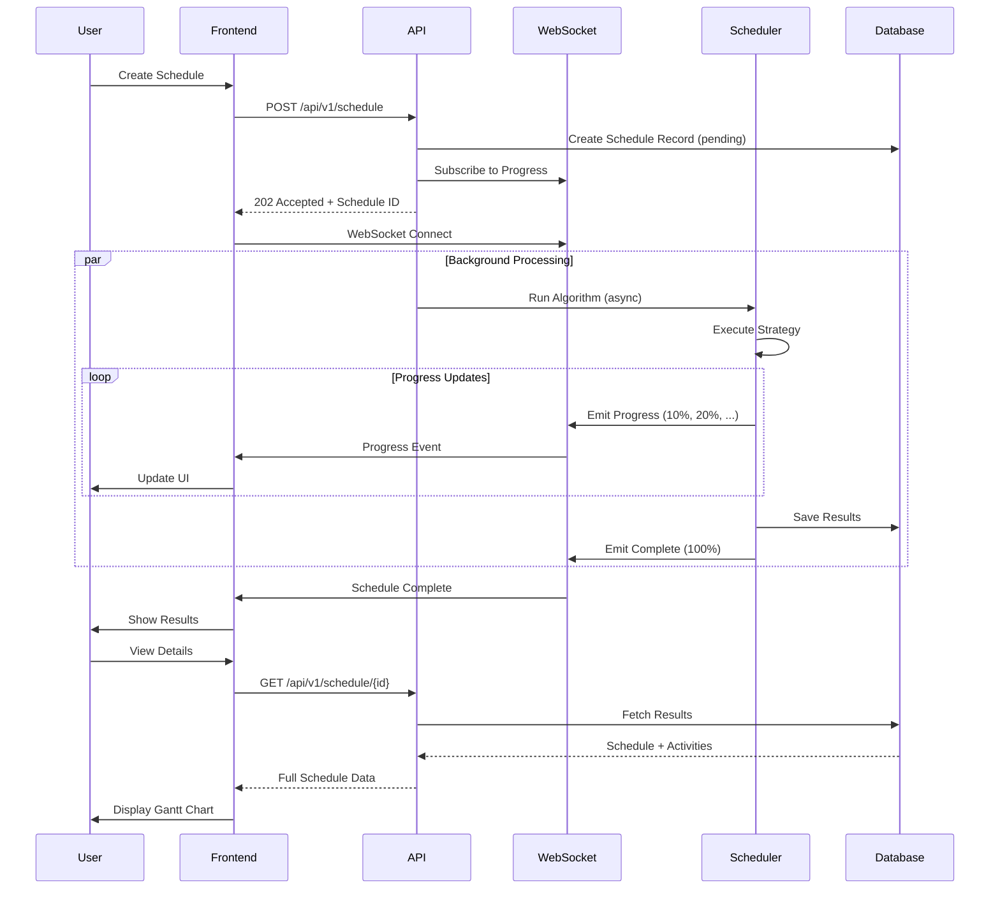

# Filling Scheduler: System Architecture

**Version:** 1.0
**Date:** October 15, 2025
**Document Purpose:** Comprehensive system architecture documentation with Mermaid diagrams

---

## Table of Contents

1. [High-Level Architecture](#1-high-level-architecture)
2. [Component Architecture](#2-component-architecture)
3. [Backend Architecture](#3-backend-architecture)
4. [Frontend Architecture](#4-frontend-architecture)
5. [Data Flow Diagrams](#5-data-flow-diagrams)
6. [Database Schema](#6-database-schema)
7. [API Architecture](#7-api-architecture)
8. [Deployment Architecture](#8-deployment-architecture)
9. [Security Architecture](#9-security-architecture)
10. [Algorithm Execution Flow](#10-algorithm-execution-flow)

---

## 1. High-Level Architecture

### 1.1 System Overview


### 1.2 Technology Stack


### 1.3 Communication Patterns



---

## 2. Component Architecture

### 2.1 System Components


### 2.2 Module Dependencies


---

## 3. Backend Architecture

### 3.1 FastAPI Application Structure


### 3.2 Service Layer Architecture


### 3.3 Background Task Processing


---

## 4. Frontend Architecture

### 4.1 React Application Structure


### 4.2 State Management Flow


### 4.3 Component Hierarchy


---

## 5. Data Flow Diagrams

### 5.1 Schedule Creation Flow


### 5.2 Authentication Flow


### 5.3 Real-time Progress Updates


### 5.4 Comparison Workflow


---

## 6. Database Schema

### 6.1 Entity Relationship Diagram


### 6.2 Database Relationships


---

## 7. API Architecture

### 7.1 API Endpoint Structure


### 7.2 Request/Response Flow


### 7.3 Authentication & Authorization


---

## 8. Deployment Architecture

### 8.1 Production Deployment (Ubuntu Server)

```mermaid
graph TB
    subgraph "Internet"
        Client[Web Browser]
        Mobile[Mobile Client]
    end

    subgraph "Ubuntu Server"
        subgraph "Nginx Layer"
            Nginx[Nginx Reverse Proxy<br/>Port 80/443]
            SSL[SSL/TLS Termination]
        end

        subgraph "Application Layer"
            Uvicorn1[Uvicorn Worker 1<br/>Port 8001]
            Uvicorn2[Uvicorn Worker 2<br/>Port 8002]
            Uvicorn3[Uvicorn Worker 3<br/>Port 8003]
            Uvicorn4[Uvicorn Worker 4<br/>Port 8004]
        end

        subgraph "Static Files"
            Frontend[React Build<br/>/opt/filling_scheduler/frontend/dist]
        end

        subgraph "Data Layer"
            DB[(SQLite/PostgreSQL<br/>Database)]
            Files[File System<br/>CSV/Reports]
        end

        subgraph "System Services"
            Systemd[Systemd Service<br/>filling-scheduler.service]
            Logs[Logs<br/>/var/log]
        end
    end

    Client -->|HTTPS| Nginx
    Mobile -->|HTTPS| Nginx

    Nginx --> SSL
    SSL -->|Static Files| Frontend
    SSL -->|/api/*| Uvicorn1
    SSL -->|/api/*| Uvicorn2
    SSL -->|/api/*| Uvicorn3
    SSL -->|/api/*| Uvicorn4

    Uvicorn1 --> DB
    Uvicorn2 --> DB
    Uvicorn3 --> DB
    Uvicorn4 --> DB

    Uvicorn1 --> Files

    Systemd -.->|Manages| Uvicorn1
    Systemd -.->|Manages| Uvicorn2
    Systemd -.->|Manages| Uvicorn3
    Systemd -.->|Manages| Uvicorn4

    Uvicorn1 -.->|Writes| Logs

    style Client fill:#e3f2fd
    style Nginx fill:#66bb6a,color:#fff
    style Frontend fill:#61dafb
    style DB fill:#4caf50,color:#fff
```

### 8.2 Development Environment

```mermaid
graph LR
    subgraph "Developer Machine"
        subgraph "Frontend Dev"
            ViteDev[Vite Dev Server<br/>Port 5173<br/>Hot Reload]
            ReactApp[React Application]
        end

        subgraph "Backend Dev"
            UvicornDev[Uvicorn<br/>Port 8000<br/>--reload]
            FastAPIApp[FastAPI Application]
        end

        subgraph "Local Data"
            SQLiteDev[(SQLite DB<br/>fillscheduler.db)]
            LocalFiles[Local CSV Files<br/>examples/]
        end

        subgraph "Development Tools"
            VSCode[VS Code<br/>+ Extensions]
            Git[Git Version Control]
            VirtualEnv[Python venv]
            NodeModules[node_modules]
        end
    end

    ViteDev --> ReactApp
    ReactApp -->|Proxy| UvicornDev
    UvicornDev --> FastAPIApp
    FastAPIApp --> SQLiteDev
    FastAPIApp --> LocalFiles

    VSCode -.->|Edits| ReactApp
    VSCode -.->|Edits| FastAPIApp
    Git -.->|Version Control| ReactApp
    Git -.->|Version Control| FastAPIApp

    VirtualEnv -.->|Python Deps| UvicornDev
    NodeModules -.->|JS Deps| ViteDev

    style ViteDev fill:#646cff
    style UvicornDev fill:#009688
    style VSCode fill:#007acc
```

### 8.3 Container Deployment (Future)

```mermaid
graph TB
    subgraph "Load Balancer"
        LB[Nginx/Traefik<br/>Port 80/443]
    end

    subgraph "Docker Compose Stack"
        subgraph "Frontend Container"
            FrontendC[Nginx + React Build<br/>filling-scheduler-frontend]
        end

        subgraph "Backend Containers"
            API1[FastAPI Container 1<br/>filling-scheduler-api]
            API2[FastAPI Container 2<br/>filling-scheduler-api]
            API3[FastAPI Container 3<br/>filling-scheduler-api]
        end

        subgraph "Database Container"
            PostgreSQL[(PostgreSQL 15<br/>filling-scheduler-db)]
        end

        subgraph "Cache Container (Future)"
            Redis[(Redis<br/>Session/Cache)]
        end

        subgraph "Shared Volumes"
            Uploads[Uploads Volume]
            Reports[Reports Volume]
        end
    end

    LB --> FrontendC
    LB --> API1
    LB --> API2
    LB --> API3

    API1 --> PostgreSQL
    API2 --> PostgreSQL
    API3 --> PostgreSQL

    API1 --> Redis
    API2 --> Redis
    API3 --> Redis

    API1 --> Uploads
    API1 --> Reports

    style LB fill:#66bb6a,color:#fff
    style FrontendC fill:#61dafb
    style API1 fill:#009688,color:#fff
    style API2 fill:#009688,color:#fff
    style API3 fill:#009688,color:#fff
    style PostgreSQL fill:#336791,color:#fff
    style Redis fill:#dc382d,color:#fff
```

---

## 9. Security Architecture

### 9.1 Security Layers

```mermaid
graph TB
    subgraph "Network Security"
        Firewall[Firewall<br/>UFW]
        SSL[SSL/TLS<br/>HTTPS Only]
        CORS[CORS Policy<br/>Allowed Origins]
    end

    subgraph "Application Security"
        JWT[JWT Authentication]
        CSRF[CSRF Protection<br/>TODO]
        RateLimit[Rate Limiting<br/>TODO]
        InputVal[Input Validation<br/>Pydantic]
        OutputSan[Output Sanitization]
    end

    subgraph "Data Security"
        Encryption[Password Hashing<br/>bcrypt]
        DBPerms[Database Permissions]
        FilePerms[File System Permissions]
        SQLInject[SQL Injection Prevention<br/>ORM]
    end

    subgraph "Infrastructure Security"
        Isolation[Process Isolation<br/>systemd]
        LeastPriv[Least Privilege<br/>www-data user]
        Logging[Audit Logging]
        Backup[Regular Backups]
    end

    Internet[Internet Traffic] --> Firewall
    Firewall --> SSL
    SSL --> CORS

    CORS --> JWT
    JWT --> RateLimit
    RateLimit --> CSRF
    CSRF --> InputVal
    InputVal --> OutputSan

    OutputSan --> Encryption
    Encryption --> DBPerms
    DBPerms --> FilePerms

    FilePerms --> Isolation
    Isolation --> LeastPriv
    LeastPriv --> Logging
    Logging --> Backup

    style Firewall fill:#ef5350,color:#fff
    style JWT fill:#66bb6a,color:#fff
    style Encryption fill:#42a5f5,color:#fff
    style Isolation fill:#ab47bc,color:#fff
```

### 9.2 Authentication Flow Security

```mermaid
sequenceDiagram
    participant C as Client
    participant F as Frontend
    participant N as Nginx
    participant A as API
    participant DB as Database

    Note over C,DB: Registration (Secure)
    C->>F: Enter Password (plain)
    F->>N: HTTPS POST /register
    N->>A: Encrypted Transport
    A->>A: Validate Input (Pydantic)
    A->>A: Hash Password (bcrypt, rounds=12)
    A->>DB: Store Hashed Password
    DB-->>A: Success
    A-->>N: 201 Created
    N-->>F: Response
    F-->>C: Success Message

    Note over C,DB: Login (Secure)
    C->>F: Enter Credentials
    F->>N: HTTPS POST /login
    N->>A: Encrypted Transport
    A->>DB: Query User by Email
    DB-->>A: User + Hashed Password
    A->>A: Verify Password (bcrypt.verify)
    alt Password Valid
        A->>A: Generate JWT (HS256)
        A->>A: Set Expiry (24h)
        A-->>N: JWT Token
        N-->>F: Token
        F->>F: Store in localStorage (HttpOnly TODO)
        F-->>C: Redirect to Dashboard
    else Invalid
        A-->>N: 401 Unauthorized
        N-->>F: Error
        F-->>C: Show Error (generic message)
    end

    Note over C,DB: Authenticated Request
    C->>F: Access Protected Resource
    F->>F: Get Token from localStorage
    F->>N: HTTPS Request + Bearer Token
    N->>A: Forward with Token
    A->>A: Decode JWT
    A->>A: Verify Signature (SECRET_KEY)
    A->>A: Check Expiry
    alt Token Valid
        A->>DB: Get User Details
        DB-->>A: User Object
        A->>A: Check is_active
        A-->>N: Protected Data
    else Token Invalid
        A-->>N: 401 Unauthorized
        N-->>F: Error
        F->>F: Clear localStorage
        F-->>C: Redirect to Login
    end
```

---

## 10. Algorithm Execution Flow

### 10.1 Strategy Selection & Execution

```mermaid
flowchart TD
    Start([Receive Schedule Request]) --> ParseInput[Parse Lots Data]
    ParseInput --> Validate[Validate Input]
    Validate --> SelectStrategy{Select<br/>Strategy}

    SelectStrategy -->|smart-pack| Smart[Smart-Pack Strategy]
    SelectStrategy -->|spt-pack| SPT[SPT-Pack Strategy]
    SelectStrategy -->|lpt-pack| LPT[LPT-Pack Strategy]
    SelectStrategy -->|cfs-pack| CFS[CFS-Pack Strategy]
    SelectStrategy -->|hybrid-pack| Hybrid[Hybrid-Pack Strategy]
    SelectStrategy -->|milp-opt| MILP[MILP-Opt Strategy]

    Smart --> Preorder1[Preorder: No Sort]
    SPT --> Preorder2[Preorder: Type Cluster + SPT]
    LPT --> Preorder3[Preorder: Global LPT Sort]
    CFS --> Preorder4[Preorder: Cluster by Type]
    Hybrid --> Preorder5[Preorder: No Sort]
    MILP --> Preorder6[Preorder: MILP Solve]

    Preorder1 --> SchedulingLoop
    Preorder2 --> SchedulingLoop
    Preorder3 --> SchedulingLoop
    Preorder4 --> SchedulingLoop
    Preorder5 --> SchedulingLoop
    Preorder6 --> SchedulingLoop

    SchedulingLoop[Main Scheduling Loop]
    SchedulingLoop --> PickNext{Pick Next Lot}

    PickNext -->|smart/hybrid| BeamSearch[Beam Search + Lookahead]
    PickNext -->|spt/lpt/cfs| GreedyFit[Greedy Fit]
    PickNext -->|milp| FollowOrder[Follow MILP Order]

    BeamSearch --> FitsWindow{Fits Current<br/>Window?}
    GreedyFit --> FitsWindow
    FollowOrder --> FitsWindow

    FitsWindow -->|Yes| AddToBlock[Add to Current Block]
    FitsWindow -->|No| StartNewBlock[Start New Block]

    AddToBlock --> MoreLots{More Lots<br/>Remaining?}
    StartNewBlock --> MoreLots

    MoreLots -->|Yes| SchedulingLoop
    MoreLots -->|No| EmitActivities[Emit Activities]

    EmitActivities --> ValidateSchedule[Validate Schedule]
    ValidateSchedule --> CalcMetrics[Calculate Metrics]
    CalcMetrics --> SaveResults[Save Results to DB]
    SaveResults --> End([Return Schedule])

    style Start fill:#4caf50,color:#fff
    style Smart fill:#ff9800,color:#fff
    style SPT fill:#2196f3,color:#fff
    style LPT fill:#2196f3,color:#fff
    style CFS fill:#9c27b0,color:#fff
    style Hybrid fill:#ff9800,color:#fff
    style MILP fill:#f44336,color:#fff
    style End fill:#4caf50,color:#fff
```

### 10.2 Smart-Pack Algorithm Flow (Detailed)

```mermaid
flowchart TD
    Start([Smart-Pack Execution]) --> Init[Initialize State]
    Init --> RemainingCheck{Lots<br/>Remaining?}

    RemainingCheck -->|No| Done[Complete]
    RemainingCheck -->|Yes| ScoreAll[Score All Candidates]

    ScoreAll --> CalcBase[Calculate Base Scores]
    CalcBase --> CalcSwitch[Apply Switch Penalty]
    CalcSwitch --> CalcSlack[Calculate Slack Waste]
    CalcSlack --> CalcStreak[Apply Streak Bonus]
    CalcStreak --> FilterFeasible[Filter Feasible Lots]

    FilterFeasible --> AnyFeasible{Any<br/>Feasible?}
    AnyFeasible -->|No| NewBlock[Start New Block]
    AnyFeasible -->|Yes| SelectTop[Select Top K Candidates]

    SelectTop --> BeamLoop[For Each Beam Candidate]
    BeamLoop --> SimulateSchedule[Simulate Scheduling]
    SimulateSchedule --> ScoreFollowers[Score All Followers]
    ScoreFollowers --> BestFollower[Find Best Follower]
    BestFollower --> ComboScore[Combo = Base + 0.25×Follower]

    ComboScore --> MoreBeam{More in<br/>Beam?}
    MoreBeam -->|Yes| BeamLoop
    MoreBeam -->|No| SelectBest[Select Best Combo]

    SelectBest --> CheckFit{Fits<br/>Window?}
    CheckFit -->|No| NewBlock
    CheckFit -->|Yes| AddLot[Add Lot to Block]

    AddLot --> UpdateState[Update State]
    UpdateState --> EmitProgress[Emit Progress]
    EmitProgress --> RemainingCheck

    NewBlock --> EmitClean[Emit CLEAN Activity]
    EmitClean --> ResetState[Reset Window State]
    ResetState --> RemainingCheck

    Done --> Return([Return Activities])

    style Start fill:#ff9800,color:#fff
    style ScoreAll fill:#fff59d
    style BeamLoop fill:#ffccbc
    style SelectBest fill:#c8e6c9
    style Return fill:#4caf50,color:#fff
```

### 10.3 MILP Optimization Process

```mermaid
sequenceDiagram
    participant API as API Service
    participant MILP as MILP Strategy
    participant Model as PuLP Model
    participant Solver as CBC Solver
    participant Result as Result Extractor

    API->>MILP: Run MILP-Opt
    MILP->>MILP: Check Size (n ≤ 30)

    alt Too Large
        MILP-->>API: RuntimeError (too many lots)
    else Acceptable Size
        MILP->>Model: Create LP Problem
        Model->>Model: Define Variables (y, u, s, e, z, p)
        Model->>Model: Set Objective (minimize blocks + changeovers)
        Model->>Model: Add Constraints

        Note over Model: Constraints:<br/>- Assignment (each lot once)<br/>- Block usage<br/>- Path structure<br/>- MTZ subtour elimination<br/>- Capacity limits

        Model->>Solver: Solve (timeLimit=60s)
        Solver->>Solver: Branch and Bound

        loop Until Optimal or Timeout
            Solver->>Solver: Explore Solution Space
            Solver->>Solver: Prune Branches
        end

        alt Optimal Found
            Solver-->>Model: Optimal Solution
            Model->>Result: Extract Variable Values
            Result->>Result: Build Block Sequences
            Result->>Result: Flatten to Lot Order
            Result-->>MILP: Ordered Lots
            MILP-->>API: Success
        else Timeout
            Solver-->>Model: Best Feasible Solution
            Model->>Result: Extract Values
            Result-->>MILP: Best Found Order
            MILP-->>API: Success (not proven optimal)
        else Infeasible
            Solver-->>Model: Infeasible
            Model-->>MILP: Error
            MILP-->>API: RuntimeError
        end
    end
```

---

## Appendix: Technology Details

### Component Versions

| Component | Version | Purpose |
|-----------|---------|---------|
| Python | 3.10+ | Backend runtime |
| FastAPI | 0.104+ | Web framework |
| React | 18 | Frontend framework |
| TypeScript | 5 | Type safety |
| SQLAlchemy | 2.0+ | ORM |
| PuLP | 2.7+ | MILP solver |
| Uvicorn | 0.24+ | ASGI server |
| Nginx | Latest | Reverse proxy |
| Vite | 5 | Build tool |

### Port Allocations

| Service | Port | Protocol |
|---------|------|----------|
| Vite Dev | 5173 | HTTP |
| FastAPI | 8000 | HTTP |
| Nginx | 80 | HTTP |
| Nginx SSL | 443 | HTTPS |
| WebSocket | 8000 | WS/WSS |

---

**Document Version:** 1.0
**Last Updated:** October 15, 2025
**Maintained By:** Filling Scheduler Development Team
**License:** GNU GPL v3.0
